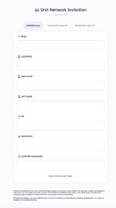

# User Guide

## Unit Network DApp User Guide Summary

The Unit Network DApp User Guide provides a comprehensive walkthrough for users aiming to harness the full potential of the platform. Below is a condensed summary of the key steps and features covered in the guide:

1. **Introduction to Unit Network:**
   Gain an understanding of the Unit Network ecosystem and its decentralized nature.
2. **Account Creation:**
   Follow a step-by-step process to create a secure account on the Unit Network platform.
3. **Exploring the Dashboard:**
   Navigate through the user-friendly dashboard to access key functionalities.
4. **Token Creation and Management:**
   Learn how to create tokens and effectively manage them within the Unit Network DApp.
5. **Decentralized Applications (dApps):**
   Explore the Software Development Kit (SDK) to develop and engage with decentralized applications.
6. **Bond Staking:**
   Participate in the staking features, understanding APY, unbonding periods, rewards, and other parameters.
7. **User Interface (UI) Testing:**
   Experience the enhanced UI with a focus on improved user experience and interface testing.
8. **Social Features and Security:**
   Leverage expanded social features, including user following, customizable newsfeeds, and enhanced security measures like whitelisting and PIN code management.
9. **Platform Analytics:**
   Utilize the analytics interface to gather detailed insights into your activities on the Unit Network.
10. **Token Gating and Self-custodial Wallets:**
    Learn how to create paywalls, control access with token gating, and empower yourself with a self-custodial wallet for enhanced security.
11. **Documentation and Tutorials:**
    Access updated documentation and interactive video tutorials for continuous learning and mastery of the platform.
12. **Innovative Features (Q4 2024):**
    Stay informed about upcoming features like the Community Feature SDK, cross-chain communication, and infinite interoperability for a transformative experience.

By following this user guide, individuals can seamlessly navigate the Unit Network DApp, engaging in token management, staking, decentralized applications, and innovative features. The guide emphasizes a user-friendly approach while empowering users to contribute to the decentralized evolution of the platform.

## By Invitation Only

Unit Network Membership is by invitation only. If you are interested in being considered for invitation to Unit Network, please reach out to an existing member or join our social media network for us to get to know you better.

