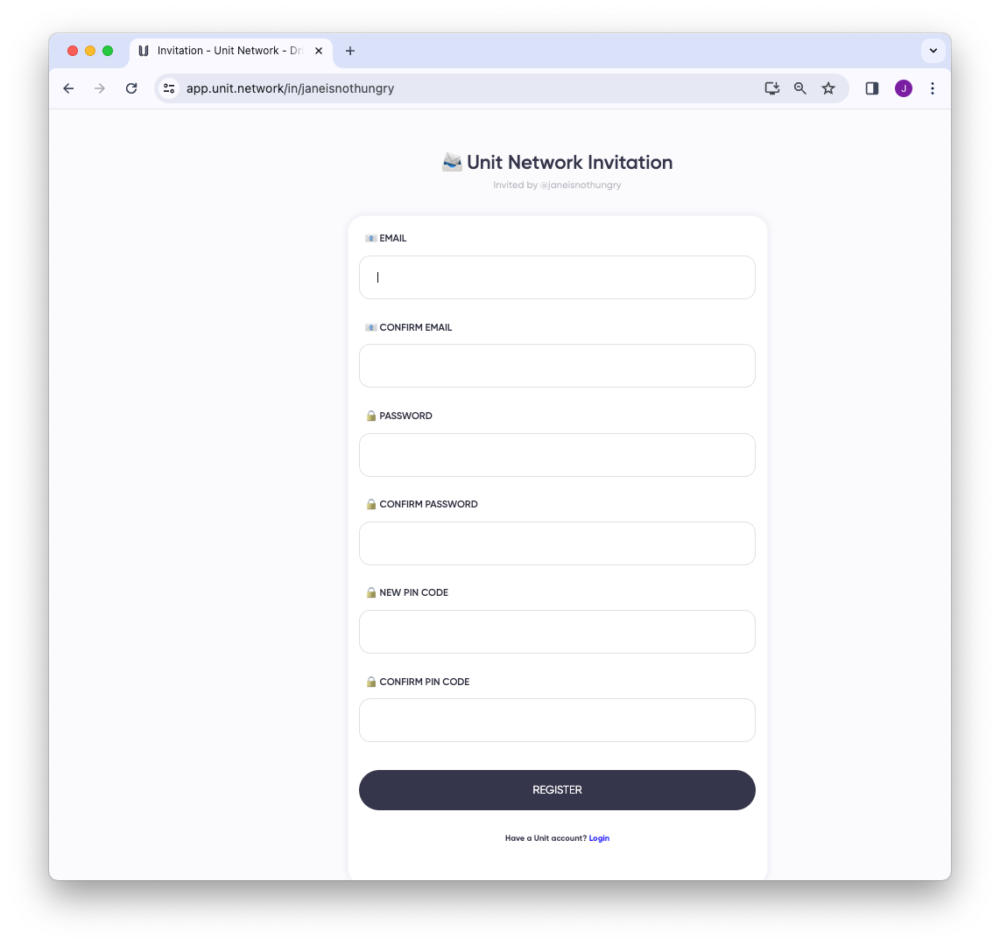
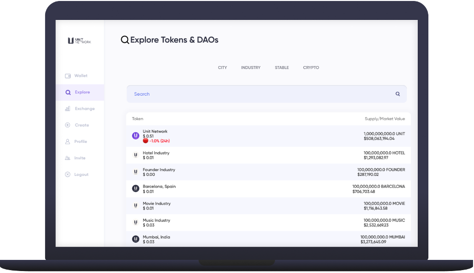
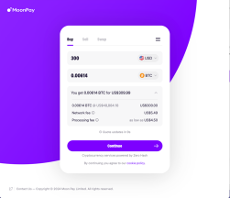
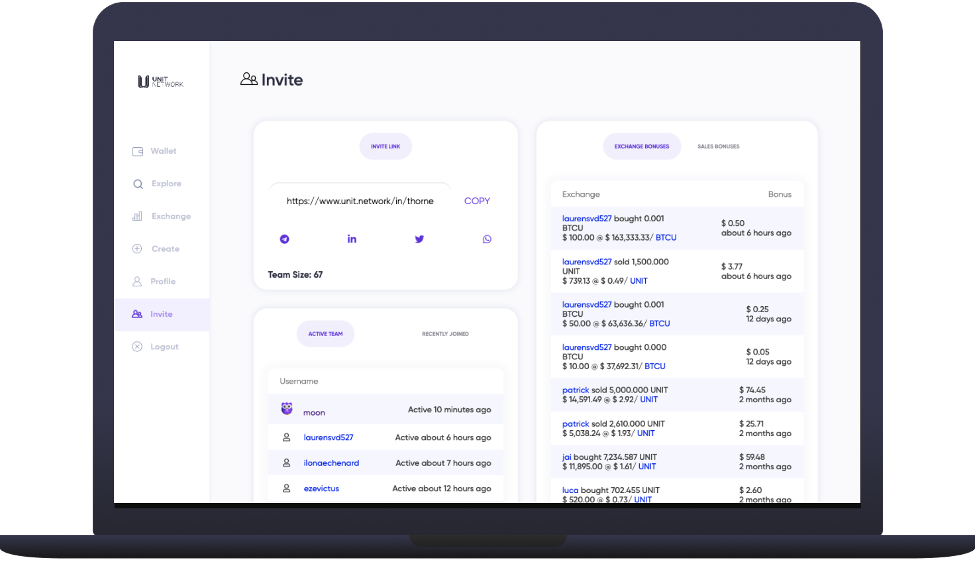

# Create an Account

### Register

Unit Network's registration process involves using an email address and password to create a new account. This account functions as a digital wallet and is seamlessly integrated with all features and apps on the Unit Network platform.

Upon your initial login, the application will generate a seed phrase. This seed phrase is crucial for account recovery in the event you forget or lose your password. It is imperative to store the seed phrase securely, as anyone with access to it can potentially gain control over your account and modify your login credentials.

### Personalize

Visit the Profile page and customize your username, social media handles, bio, and other details. This customization enhances your discoverability as more users join the network and search for individuals or businesses.

In Unit Network, every username must be unique. It is advised to personalize your username, whether it's public or pseudonymous, through the Profile/Settings section. This is important as various functionalities such as transfers, chat, whitelisting, teams, etc., operate on a username basis.

### Explore

You can discover friends, projects, businesses, tokens, or DAOs by using the 'Explore' tab. When you select a user or token, a dashboard will be displayed, providing options to trade, stake, buy, and review all the relevant token information. This 'Explore' feature facilitates easy navigation and engagement with various entities within the Unit Network platform.

> 'Follow' users or tokens to ensure users have first access to updates and notifications. By following specific users or tokens, individuals can stay informed about any developments, news, or activities related to those entities within the Unit Network platform. This feature enhances user engagement and facilitates timely access to relevant information.

> Monitoring token treasuries is essential. A token with an empty treasury implies speculative value with unclear downside risks. In the crypto space, funds sent to a token treasury can only be redeemed by token holders. They may send tokens back to the treasury, effectively burning them, to receive a proportionate share of the held value. This process establishes a floor price and helps mitigate risks for token holders, providing a level of transparency and stability within the token's ecosystem.

**1.1.1 Deposit Crypto**

To deposit your cryptocurrency into Unit Network, you can use the Deposit tab within your user wallet.

It's important to note that some deposits may take a few hours to confirm. This delay could be due to network confirmations or other factors inherent in the cryptocurrency transaction process. Users should be patient and allow the necessary time for the deposit to be confirmed before expecting it to be reflected in their Unit Network wallet.

> It is crucial not to send your cryptocurrency to Unit Network via a centralized exchange such as Binance or Coinbase. Instead, the crypto should be sent from a self-custodial wallet like Ledger, Trezor, MetaMask, Exodus, etc. This ensures that the transaction can be verified, highlighting the importance of using wallets where users have full control of their private keys. Sending crypto from centralized exchanges might result in difficulties verifying transactions, and it's recommended to adhere to the specified self-custodial wallet options for a smooth and secure process.

**1.1.1 Buy Crypto**

If you don't already have cryptocurrency, you can make your initial purchase with your debit or credit card through Moonpay.

https://buy.moonpay.com/

This process typically takes about 10 minutes to complete, including Know Your Customer (KYC) confirmation. Moonpay facilitates a convenient way for users to acquire cryptocurrency using traditional payment methods, streamlining the onboarding process for those who are new to the cryptocurrency space.

**1.1.1 Enhance your token portfolio**

Enhance Your Token Portfolio

Discover various enticing incentives embedded in the platform, available for all users who opt to leverage them.

- Share your invite link and earn 0.5% of all trades conducted by your referrals. [Read more]
- Stake your tokens in liquidity pools to earn up to 0.5% of the trades. [Read more]
- Bond stake your UNIT for an impressive (up to) 10% APY. [Read more]
- Lock your UNIT in the Vaults to access crypto loans. [Read more]

Explore these opportunities to maximize your gains and elevate your token experience.

### Acquire Unit tokens

Discover how to obtain the Unit Network (UNIT) token through various channels:

1.  UNIT Exchange: Acquire UNIT using the native Unit Network DEX (Decentralized Exchange).
2.  UNIT Sale Page: Purchase UNIT from the native Unit Network sale page.
3.  Earn UNIT: Engage with Ecosystem Apps, DAOs, or become a Core Team member to earn UNIT.
4.  Staking Rewards: Utilize various staking methods to earn additional UNIT if you already possess some.
5.  Peer-to-Peer: Purchase UNIT directly from other users who accept direct payments.
6.  UnitChain Launch: Stay tuned for additional options that will be unveiled post the launch of the UnitChain.
7.  External Exchanges: Note that UNIT is currently exclusive to the Unit Network protocol and is not listed on external exchanges.

Explore these avenues to secure your UNIT tokens and actively participate in the Unit Network ecosystem.

> Note that we may not make all of the Services available in all markets and jurisdictions, and may restrict or prohibit use of all or a portion of the Services from Restricted Locations. The content of the Terms shall not be excluded from the laws of the country or region under which the user belongs. As a result, if you do not meet these eligibility requirements, do not use our Services. Do your own research and participate accordingly.
